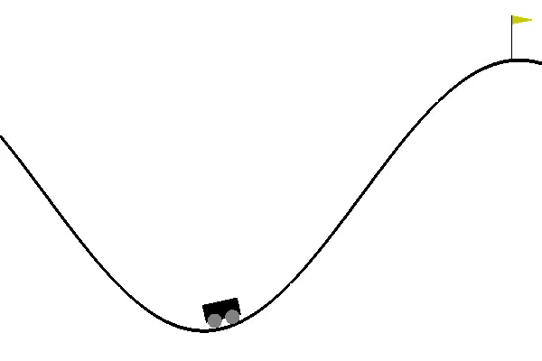

# University of Tehran, Interactive Learning Course Hands-Ons, Fall 1398(2019)

## Hands-On 2

### P1
Train agents to maximize the obtained reward from a 3-armed bandit.

Epsilon-Greedy and Softmax algorithms are implemented and tested.

`Best Average Reward of epsilon-greedy: 0.43`

`Best Average Reward of Softmax: 0.79`

### P2

Train an agent to maximize the obtained reward from a 10-armed bandit. 

UCB1 Algorithm is implemented and tested.

### P3

Train an agent to maximize the obtained reward from a 4-armed bandit. 

Thompson Sampling Algorithm is implemented and tested.

## Hands-On 3

Train agents to learn play Frozen-Lake.

Value Iteration, Q-Learning, and SARSA algorithms are implemented and tested.

## Hands-On 4

Train an agent to learn play MountainCar-v0 from gym library.

Value Iteration and SARSA algorithms are implemented and tested.

### Trained Mountain Car Agent:
